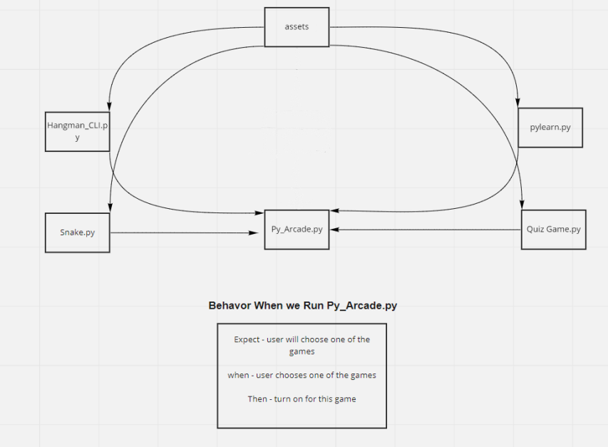

# **Team Members:** 
* Musa'b Shalaldeh 
* Ahmad Alrasheed
* Jehad Abu Awwad
* Suzan Hiary
# PyArcade Games(CLI Application)

Its a collection of Command line games  for the purpose of entertainment with different and special ideas deployed with amazing ASCI art.

The list of games that we will have in Py Arcade games will be :

* Hangman CLI

> Hangman is a paper and pencil guessing game for two or more players. One player thinks of a word, phrase or sentence and the other(s) tries to guess it by suggesting letters within a certain number of guesses.

* Quiz Game CLI

> A set of  general questions the  players attempt to answer questions correctly about a certain or variety of subjects. the players will get a plus point for each correct answer

* Snake game

> The player controls a dot, square, or object on a bordered plane. As it moves forward, it leaves a trail behind, resembling a moving snake. In some games, the end of the trail is in a fixed position, so the snake continually gets longer as it moves.

* Tic-Tac-Toe

> is a game in which two players take turns in drawing either an ' O' or an ' X' in one square of a grid consisting of nine squares. The winner is the first player to get three of the same symbols in a row

### Special Idea

* Pylearn

A game for learning programming using Python, and to teach the user how to make his first program using python , and the user will have amazing instructor to teach him the basics of programming in general and specially in Python.

# Getting Started:

Clone this repository to your local machine. [git@github.com: MusaabShalaldeh/automation.git]()

Then, install all required dependencies by typing:
```bash
poetry install
poetry shell
```
Load up the project using your favorite IDE.

# User Stories

The stories of PyArcade game are managed in a project managment system for the interface of the project and for every game at a seperte side

**Link for Project managment system** : [Link](https://trello.com/b/7Hd4NGWM/pyarcade-game)

# Software Requirements

The Software requirements are mentioned with vision , scope , MVP and functional and non-functional requirements.

**Link for Software Requirements** : [Link](requirements.md)

# Domain Modeling

**The Model of domain defined as module based system as the following :**



# References
* Hangman CLI :[Link](https://codereview.stackexchange.com/questions/214471/display-command-line-hangman)

* Quiz Game CLI : [Link](https://northcoders.com/company/blog/how-do-you-make-a-command-line-quiz-generator)

* Snake game : [link](https://www.edureka.co/blog/snake-game-with-pygame/)

* Tic-Tac-Toe : [link](https://geekflare.com/tic-tac-toe-python-code/)
# Technologies Used:
* Python
* Visual Studio Code 
* Trello 
# Change log:

Version 0.1.0 : initial project version
